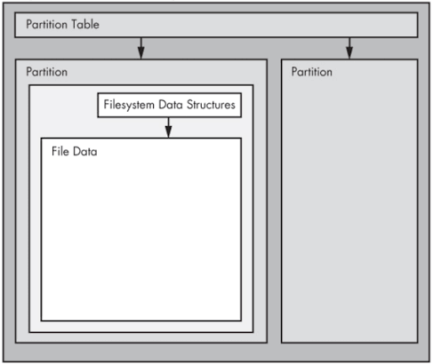

### Disk and Filesystem

A **Disk** refers to the Physical storage device like HDD, SSD, USB, etc.
If we take example of a SSD, so the connected ssd to our device is devided into logical parts called Partitions.
Each partition on the disk have its own Filesystem. 
So lets say we have following 2 partitions:
* nvme0n1p6
* nvme0n1p7
Now in order to use these partitons they must contain a FileSystem like ext4, etc. Without a filesystem its not humanly possible to read and write to the disk.

The Disk device contains a `Partition Table` which can be `MBR (Master Boot Record)` or newer `Globally Unique Identifier Partition Table (GPT)`. This table contains information about the partitions of tht disk.
Each partition is represented as a number at the end of the disk file name.
Example:
```
sda1
sda2
nvme0n1p6
nvme0n1p7
```

#### Typical Linux Disk Schematic



### Partitioning Disk Devices
There are many kinds of partition tables. There's nothing special about a partition table -- it's just a bunch of data that says how the blocks on the disks are divided.

The traditional Partition table is found under `MBR (Master Boot Record)`, the latest one is `GPT (Globally Unique Identifier Partition Table)`.

#### Linux Partitioning Tools
* `parted`
* `gparted`
* `fdisk`

These tools are used to display, alter etc. operations on the Partition Table